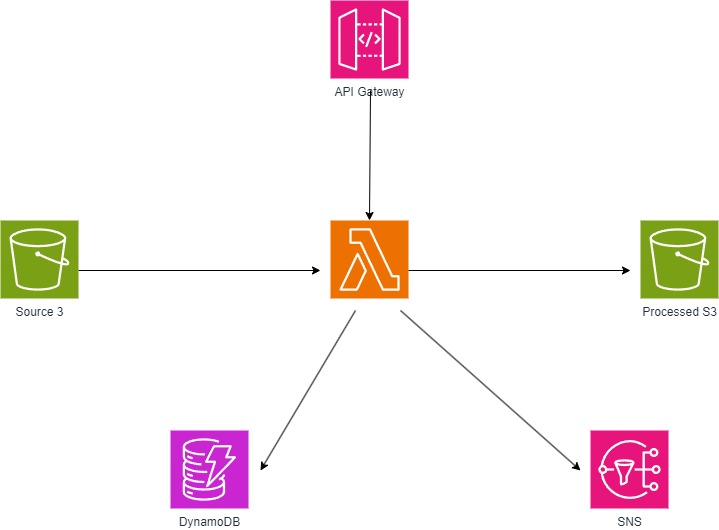

# AWS Lambda Image Processing Service

A serverless image processing service built on AWS that automatically processes and resizes images upon upload. This service leverages various AWS services to provide a scalable, efficient, and cost-effective solution for image processing needs.

## Table of Contents
- [Architecture Overview](#architecture-overview)
- [Features](#features)
- [Prerequisites](#prerequisites)
- [AWS Services Used](#aws-services-used)
- [Project Structure](#project-structure)
- [Installation](#installation)
- [Configuration](#configuration)
- [Usage](#usage)
- [API Documentation](#api-documentation)
- [Contributing](#contributing)
- [License](#license)

## Architecture Overview



The service follows a serverless architecture pattern:
1. Images are uploaded to an S3 bucket (source bucket)
2. Upload triggers a Lambda function automatically
3. Lambda processes the image using the Sharp library
4. Processed images are stored in a separate S3 bucket
5. Metadata is stored in DynamoDB
6. Processing completion notification is sent via SNS
7. Manual processing can be triggered via API Gateway

## Features

- **Automatic Image Processing**: Processes images automatically upon upload
- **Multiple Output Sizes**:
  - Thumbnail (150x150px)
  - Medium (800x800px)
  - Large (1600x1600px)
- **Metadata Storage**: Stores comprehensive image metadata in DynamoDB
- **Format Optimization**: Converts and optimizes images to JPEG format
- **Aspect Ratio Preservation**: Maintains original aspect ratios while resizing
- **REST API**: Enables manual processing trigger via HTTP endpoint
- **Notification System**: SNS notifications upon completion
- **Error Handling**: Comprehensive error handling and logging

## Prerequisites

- AWS Account with appropriate permissions
- Terraform >= 1.0.0
- Node.js >= 18.x
- AWS CLI configured
- Git

## AWS Services Used

- **AWS Lambda**: Serverless compute for image processing
- **Amazon S3**: Storage for original and processed images
- **Amazon DynamoDB**: NoSQL database for metadata storage
- **Amazon SNS**: Notification service for process completion
- **Amazon API Gateway**: REST API endpoint for manual triggers
- **AWS IAM**: Resource access management

## Project Structure

```
.
├── terraform/
│   ├── main.tf
│   ├── variables.tf
│   └── outputs.tf
├── src/
│   ├── package.json
│   └── index.js
├── .gitignore
└── README.md
```

## Installation

1. Clone the repository:
```bash
git clone https://github.com/yourusername/aws-lambda-image-processor.git
cd aws-lambda-image-processor
```

2. Install Lambda function dependencies:
```bash
cd src
npm install
```

3. Create Lambda deployment package:
```bash
zip -r ../terraform/lambda_function.zip index.js node_modules/
cd ..
```

4. Initialize Terraform:
```bash
cd terraform
terraform init
```

5. Deploy the infrastructure:
```bash
terraform apply
```

## Configuration

1. Update Terraform variables in `terraform/variables.tf`:
```hcl
variable "aws_region" {
  default = "us-west-2"
}

variable "environment" {
  default = "prod"
}
```

2. Configure S3 bucket names in `terraform/main.tf`:
```hcl
resource "aws_s3_bucket" "source_bucket" {
  bucket = "your-source-bucket-name"
}
```

## Usage

### Via S3 Upload

1. Upload an image to the source S3 bucket:
```bash
aws s3 cp image.jpg s3://your-source-bucket-name/
```

2. The image will be automatically processed

### Via API Endpoint

1. Get the API endpoint from Terraform outputs:
```bash
terraform output api_endpoint
```

2. Trigger processing via HTTP POST:
```bash
curl -X POST https://your-api-endpoint/prod/process \
  -H "Content-Type: application/json" \
  -d '{"sourceBucket": "your-bucket", "sourceKey": "image.jpg"}'
```

## API Documentation

### Process Image Endpoint

- **URL**: `/process`
- **Method**: `POST`
- **Content-Type**: `application/json`
- **Request Body**:
  ```json
  {
    "sourceBucket": "string",
    "sourceKey": "string"
  }
  ```
- **Success Response**:
  ```json
  {
    "message": "Image processing complete",
    "images": 1
  }
  ```

## Monitoring and Logging

- Lambda function logs are available in CloudWatch Logs
- Processing notifications are sent to the configured SNS topic
- Metadata is stored in DynamoDB for tracking and auditing

## Cost Considerations

The service uses AWS serverless technologies with pay-per-use pricing:
- Lambda: Charged per request and compute time
- S3: Storage and transfer costs
- DynamoDB: Storage and read/write capacity
- SNS: Message publishing
- API Gateway: Request handling

## Security

- S3 buckets are configured with appropriate versioning and access policies
- Lambda functions run with minimal required IAM permissions
- API Gateway endpoints can be configured with AWS_IAM authentication
- All resources are created within a defined AWS region

## Contributing

1. Fork the repository
2. Create a feature branch
3. Commit your changes
4. Push to the branch
5. Create a Pull Request

## License

This project is licensed under the MIT License - see the LICENSE file for details.

## Acknowledgments

- Sharp image processing library: https://sharp.pixelplumbing.com/
- Terraform AWS Provider: https://registry.terraform.io/providers/hashicorp/aws/latest
- AWS SDK for JavaScript: https://aws.amazon.com/sdk-for-javascript/

## Support

For support, please open an issue in the GitHub repository or contact the me (njeufacknarcisse1@gmail.com).

---
*Note: Remember to replace placeholder values (like bucket names and region) with your actual values before deployment.*
